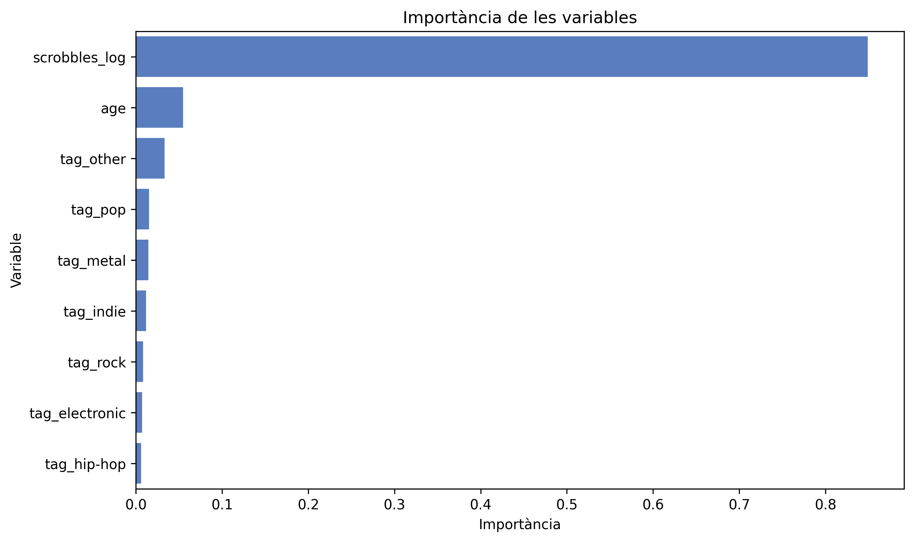
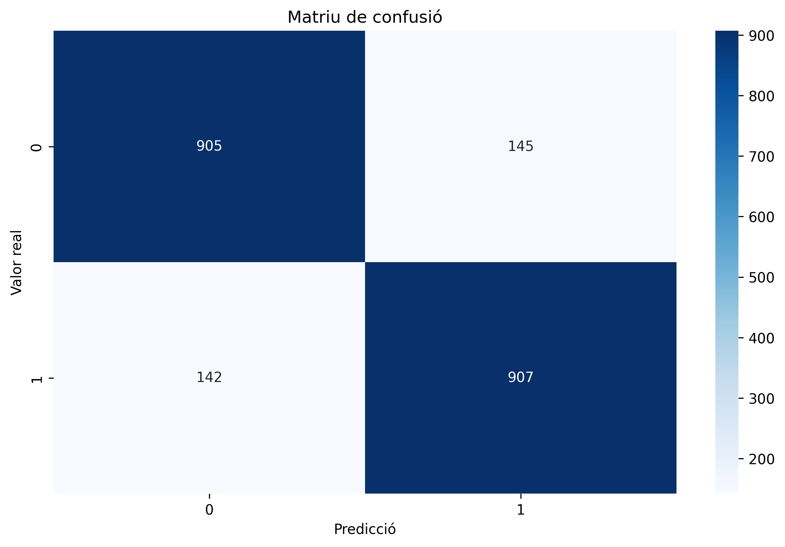
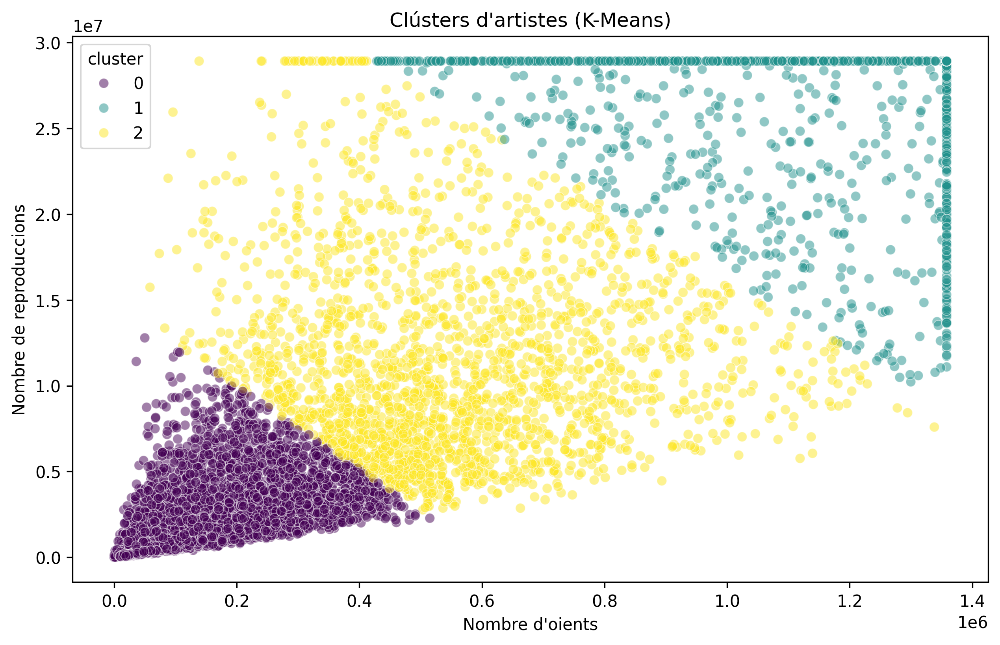

# 🎧 Last.fm Data Pipeline

Pipeline de dades desenvolupat en **Python** per obtenir, processar i analitzar dades musicals de Last.fm.

El projecte cobreix diferents etapes del cicle de vida de les dades: des de l'obtenció mitjançant **web scraping** fins a la neteja, l'anàlisi exploratòria i estadística, la visualització i l'aplicació de tècniques de **Machine Learning**.

## 🎯 Objectiu

L'objectiu del projecte és construir un flux complet de dades a partir d'informació pública de Last.fm, transformant dades obtingudes de la web en un conjunt estructurat que permeti analitzar patrons de popularitat i comportament dels artistes.

El projecte s'organitza en dues grans fases:

### 1. Adquisició i preparació de dades

- Anàlisi prèvia del lloc web.
- Extracció de dades mitjançant web scraping.
- Ús de **BeautifulSoup** i **Selenium** segons el tipus de contingut.
- Gestió d'errors i reintents.
- Pauses entre peticions per realitzar una extracció responsable.
- Consolidació dels resultats obtinguts.

### 2. Anàlisi de dades

- Càrrega i validació dels datasets.
- Neteja i transformació de les dades.
- Anàlisi exploratòria de dades (EDA).
- Anàlisi estadística.
- Visualització dels resultats.
- Modelització mitjançant tècniques de Machine Learning.

## 🔄 Pipeline

El flux general del projecte és:

```text
Last.fm
   ↓
Web Scraping
   ↓
Raw Data
   ↓
Data Cleaning & Transformation
   ↓
Exploratory Data Analysis
   ↓
Statistical Analysis
   ↓
Machine Learning
   ↓
Results & Visualizations
```

L'adquisició i l'anàlisi es mantenen com a dues etapes independents:

- `src/run_scraping.py` — executa el procés d'obtenció i consolidació de dades.
- `src/run_analysis.py` — executa el procés de neteja, anàlisi i modelització.

## 🌐 Web scraping

La fase d'adquisició combina dues estratègies d'extracció.

### BeautifulSoup

S'utilitza per extreure informació disponible directament al contingut HTML de les pàgines.

### Selenium

S'utilitza per treballar amb contingut dinàmic que requereix la interacció amb un navegador.

El procés incorpora funcions auxiliars per al tractament de text i valors numèrics, control de duplicats, gestió d'errors i consolidació dels resultats.

Abans de l'extracció també es realitza una anàlisi prèvia del lloc web per estudiar-ne l'estructura i les característiques tècniques.

## 🧹 Processament de dades

Les dades obtingudes passen per diferents processos de preparació abans de l'anàlisi:

- Càrrega i validació dels fitxers.
- Tractament de valors absents.
- Eliminació de duplicats.
- Correcció de tipus de dades.
- Detecció i tractament de valors atípics.
- Transformació de variables.
- Generació d'un dataset net per a l'anàlisi posterior.

El dataset processat es conserva a `outputs/data/`.

## 📊 Anàlisi exploratòria i estadística

L'anàlisi permet estudiar les relacions entre les diferents mètriques associades als artistes i explorar els patrons presents a les dades.

Entre els resultats obtinguts destaca una **correlació de Spearman de 0,92 entre listeners i scrobbles**, que mostra una associació positiva molt elevada entre ambdues variables.

També es realitzen contrastos estadístics per comparar el comportament de diferents grups. En la comparació entre artistes de **Rock i Pop**, el test de Mann–Whitney no proporciona evidència suficient per afirmar una diferència estadísticament significativa (`p = 0,0678`).

Els resultats estadístics generats es poden consultar a:

`outputs/reports/stats_report.json`

## 🤖 Machine Learning

El projecte incorpora tècniques d'aprenentatge supervisat i no supervisat.

### Random Forest

S'entrena un model de classificació per identificar artistes amb alta popularitat a partir de les variables disponibles.

El model obté una **accuracy aproximada de 0,86**.

L'anàlisi de la importància de les variables mostra que `scrobbles_log` és una de les variables amb més pes en la classificació.

### K-Means

També s'aplica clustering per identificar agrupacions naturals entre els artistes.

La configuració seleccionada utilitza **3 clústers** i obté un **Silhouette Score aproximat de 0,63**.

Els resultats dels models es poden consultar a:

`outputs/reports/models_report.json`

## 📊 Resultats visuals

### Importància de variables



### Matriu de confusió



### Clustering amb K-Means



## 📈 Visualitzacions

El pipeline genera diferents visualitzacions per facilitar l'exploració i interpretació dels resultats, entre elles:

- Matriu de correlacions.
- Distribucions de variables.
- Boxplots.
- Comparacions de popularitat per gènere.
- Matriu de confusió del model de classificació.
- Importància de variables.
- Visualització dels clústers.
- Anàlisi del Silhouette Score.

Les figures generades es troben a:

`outputs/img/`

## 🛠️ Tecnologies utilitzades

### Web scraping
- Python
- BeautifulSoup
- Selenium
- Requests

### Anàlisi i processament de dades
- pandas
- NumPy
- SciPy

### Machine Learning
- scikit-learn
- Random Forest
- K-Means

### Visualització
- Matplotlib
- Seaborn

### Altres
- Git / GitHub
- Pylint

## 📁 Estructura del repositori

```text
lastfm-data-pipeline/
│
├── src/
│   ├── scraping/
│   │   ├── __init__.py
│   │   ├── pre_analysis.py
│   │   ├── scraper_bs.py
│   │   ├── scraper_selenium.py
│   │   └── scraping_utils.py
│   │
│   ├── processing/
│   │   ├── __init__.py
│   │   ├── merge_datasets.py
│   │   ├── loading.py
│   │   └── cleaning.py
│   │
│   ├── analysis/
│   │   ├── __init__.py
│   │   ├── statistics.py
│   │   ├── visualization.py
│   │   └── models.py
│   │
│   ├── __init__.py
│   ├── utils.py
│   ├── run_scraping.py
│   └── run_analysis.py
│
├── data/
│   ├── artists_bs4.csv
│   └── dataset_crawler.csv
│
├── outputs/
│   ├── data/
│   ├── img/
│   └── reports/
│
├── .gitignore
├── requirements.txt
└── README.md
```

## ⚙️ Instal·lació

Clona el repositori:

```bash
git clone https://github.com/CatiMercer/lastfm-data-pipeline.git
cd lastfm-data-pipeline
```

Instal·la les dependències:

```bash
pip install -r requirements.txt
```

## ▶️ Execució

El projecte separa l'adquisició de dades de l'anàlisi posterior.

### Executar el web scraping

```bash
python -m src.run_scraping
```

### Executar l'anàlisi

```bash
python -m src.run_analysis
```

Els datasets i resultats generats es guarden a les carpetes `data/` i `outputs/`.

## 👥 Autoria

Projecte desenvolupat originalment per **[Ayany Alvarado](https://github.com/ayanyag)** i **[Catalina Mercer](https://github.com/CatiMercer)** en el marc del **Màster Universitari en Ciència de Dades de la Universitat Oberta de Catalunya (UOC)**.

El projecte original es va desenvolupar de manera col·laborativa en dues fases: obtenció i preparació de dades mitjançant web scraping, i posterior anàlisi, visualització i modelització de les dades.

Aquesta versió ha estat posteriorment reorganitzada i documentada per **Catalina Mercer** com a projecte de portfolio, amb el consentiment de l'altra autora.

## ⚠️ Ús responsable

Aquest projecte té finalitats acadèmiques i demostratives.

Qualsevol procés de web scraping s'ha de realitzar respectant les condicions d'ús del lloc web, les indicacions de `robots.txt` i aplicant una freqüència de peticions responsable.
